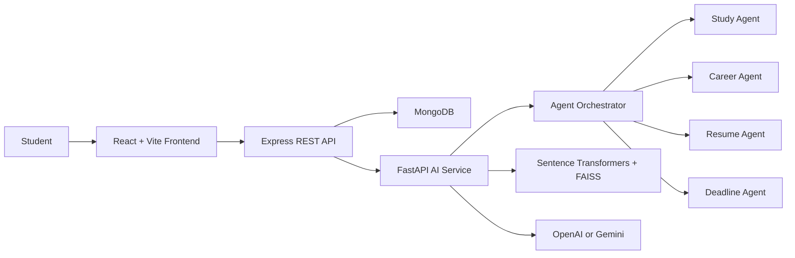

# CampusCopilot AI

CampusCopilot AI is a production-ready AI-native full-stack application for students. It combines a React dashboard, secure Node.js APIs, MongoDB persistence, and a Python FastAPI AI layer with autonomous agents, semantic search, resume analysis, study planning, and copilot chat.

## Architecture



## Features

- JWT authentication with protected routes.
- Dashboard for deadlines, recommendations, study progress, and opportunities.
- Resume PDF upload, extraction, skill gap analysis, and improvement suggestions.
- Multi-agent orchestration for study, career, resume, and deadline intelligence.
- Semantic opportunity and learning search using sentence-transformer embeddings and FAISS.
- AI copilot chat with OpenAI, Gemini, or deterministic fallback responses.
- Assignment manager with AI task prioritization and reminders.
- Clean REST API structure, environment variables, validation, and centralized error handling.

## Folder Structure

```text
campuscopilot-ai/
  frontend/          React, Vite, Tailwind, React Router, Axios
  backend/           Node.js, Express, MongoDB, JWT, file upload APIs
  ai-service/        FastAPI, agents, embeddings, FAISS, LLM adapters
  docker-compose.yml Local deployment for Mongo, API, AI, and web
```

## Quick Start

### 1. Backend

```bash
cd backend
cp .env.example .env
npm install
npm run dev
```

### 2. AI Service

```bash
cd ai-service
cp .env.example .env
python -m venv .venv
.venv\\Scripts\\activate
pip install -r requirements.txt
uvicorn app.main:app --reload --port 8000
```

### 3. Frontend

```bash
cd frontend
cp .env.example .env
npm install
npm run dev
```

Open `http://localhost:5173`.

## Environment Variables

Backend:

- `PORT=5000`
- `MONGODB_URI=mongodb://127.0.0.1:27017/campuscopilot`
- `JWT_SECRET=replace-with-a-long-secret`
- `AI_SERVICE_URL=http://localhost:8000`
- `CLIENT_ORIGIN=http://localhost:5173`

AI service:

- `OPENAI_API_KEY=`
- `GEMINI_API_KEY=`
- `LLM_PROVIDER=mock` (`openai`, `gemini`, or `mock`)
- `EMBEDDING_MODEL=sentence-transformers/all-MiniLM-L6-v2`

Frontend:

- `VITE_API_URL=http://localhost:5000/api`

## API Documentation

The backend serves OpenAPI JSON at:

```text
GET /api/docs
```

Core endpoints:

- `POST /api/auth/register`
- `POST /api/auth/login`
- `POST /api/resume/upload`
- `POST /api/resume/analyze`
- `POST /api/study/generate`
- `POST /api/career/roadmap`
- `GET /api/opportunities/search`
- `POST /api/copilot/chat`
- `GET /api/tasks`
- `POST /api/tasks`
- `PUT /api/tasks/:id`
- `DELETE /api/tasks/:id`

## Docker Deployment

```bash
docker compose up --build
```

Services:

- Frontend: `http://localhost:5173`
- Backend: `http://localhost:5000`
- AI service: `http://localhost:8000`
- MongoDB: `localhost:27017`

## Production Notes

- Set strong `JWT_SECRET` and API keys in your platform secret manager.
- Restrict `CLIENT_ORIGIN` to trusted domains.
- Use MongoDB Atlas or a managed MongoDB service in production.
- Put the backend and AI service behind HTTPS.
- For resume uploads, configure persistent object storage instead of local `uploads/`.
- The AI service includes deterministic fallbacks so demos work without paid LLM keys.

## Public Deployment

Use this setup for a hackathon demo with public URLs:

1. Create a MongoDB Atlas cluster and copy the connection string.
2. Deploy `render.yaml` on Render as a Blueprint.
3. In Render, set:
   - `MONGODB_URI` to the Atlas connection string.
   - `CLIENT_ORIGIN` to the final Vercel frontend URL.
   - Optional `OPENAI_API_KEY` or `GEMINI_API_KEY`; otherwise mock mode works.
4. Deploy the `frontend` folder on Vercel.
5. In Vercel, set:
   - `VITE_API_URL=https://YOUR_RENDER_BACKEND_URL/api`
6. Redeploy the frontend after setting `VITE_API_URL`.
